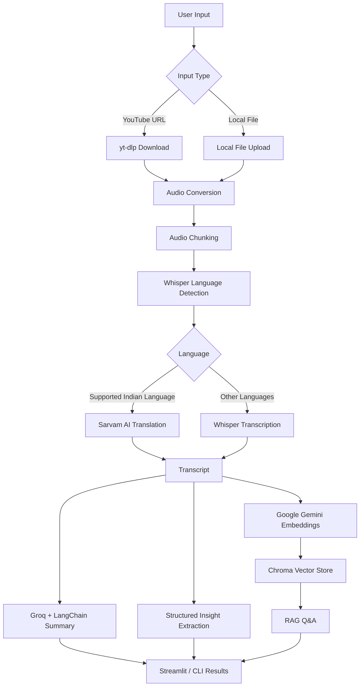

# AI Video Assistant

This assistant can turn long videos into useful knowledge using a Python AI pipeline powered by Streamlit, a CLI interface, yt-dlp, FFmpeg, pydub, OpenAI Whisper, Sarvam AI, LangChain, Groq's `llama-3.3-70b-versatile`, Google Gemini embeddings, and ChromaDB. It supports multiple languages, with Hindi and other supported Indian-language transcription handled by Sarvam AI.

Paste a YouTube URL or upload a local media file, and the app downloads the audio, transcribes it, summarizes the content, extracts structured insights, builds a searchable knowledge index, and lets you chat with the video transcript.

The project is built as a local-first AI workflow with a polished Streamlit interface and a CLI pipeline for terminal usage.

## What It Does

- Downloads audio from YouTube links with `yt-dlp`.
- Accepts local media files such as `mp4`, `mp3`, `wav`, `m4a`, and `webm`.
- Converts media to clean mono 16 kHz WAV audio with FFmpeg through `pydub`.
- Splits long audio into chunks so large videos can be processed reliably.
- Detects the spoken language automatically with Whisper.
- Transcribes most languages locally with OpenAI Whisper.
- Routes supported Indian languages through Sarvam AI for speech-to-English translation.
- Generates a concise professional summary with Groq-hosted LLMs through LangChain.
- Produces a short title for each processed video.
- Extracts action items, key decisions, conclusions, and open questions.
- Builds a persistent Chroma vector index for every session.
- Lets you ask natural-language questions about the video using transcript-grounded RAG.
- Supports saved sessions so you can resume previous video chats.
- Offers both a Streamlit UI and a terminal-based CLI flow.

## Architecture



## Project Structure

```text
ai-video-assistant/
├── app.py                    # Streamlit UI
├── main.py                   # CLI entry point
├── core/
│   ├── transcriber.py        # Whisper + Sarvam transcription routing
│   ├── summarise.py          # LangChain summarization and title generation
│   ├── extractor.py          # Action items, decisions, and open questions
│   ├── engine.py             # RAG chain construction and Q&A
│   └── vector_store.py       # Gemini embeddings + Chroma persistence
├── utils/
│   └── audio_processor.py    # YouTube/local audio processing pipeline
├── chroma-db/                # Generated local vector stores and session metadata
├── downloads/                # Generated downloaded/converted audio files
├── requirements.txt          # Python dependency list
├── pyproject.toml            # Project metadata and uv-compatible dependencies
├── packages.txt              # System package hints such as ffmpeg
└── .streamlit/config.toml    # Streamlit theme and local server config
```

## Tech Stack

### Application

- **Python** for the end-to-end processing pipeline.
- **Streamlit** for the interactive web UI.
- **CLI mode** through `main.py` for terminal workflows.

### Audio Processing

- **yt-dlp** for YouTube audio extraction.
- **FFmpeg** for audio decoding and conversion.
- **pydub** for WAV conversion, mono/16 kHz normalization, and chunking.

### Speech-to-Text

- **OpenAI Whisper** for local transcription and language detection.
- **Sarvam AI** for supported Indian-language speech-to-English translation.

### LLM and Orchestration

- **LangChain** for prompt templates, runnable chains, text splitting, and RAG orchestration.
- **Groq** with `llama-3.3-70b-versatile` for summaries, insight extraction, titles, and answers.

### Retrieval

- **Google Gemini embeddings** via `models/gemini-embedding-001`.
- **ChromaDB** for persistent local vector storage.
- **MMR retrieval** for relevant, diverse transcript chunks during Q&A.

## Core Features

### Video Understanding Pipeline

The app does more than transcribe. It turns a raw video into a structured knowledge artifact:

- full transcript
- concise summary
- generated title
- action items
- key decisions and conclusions
- open questions
- searchable Q&A index

### Multilingual Handling

Whisper detects language from the first audio chunk. If the language is one of the supported Indian languages, the pipeline routes chunks through Sarvam AI for translation to English. Other languages are handled by Whisper directly.

Supported Sarvam routing codes include:

```text
hi, bn, kn, ml, mr, or, pa, ta, te, gu
```

### Persistent Sessions

Processed videos are saved under `chroma-db/` using a deterministic session ID derived from the source. This lets the app reload an existing Chroma index and resume transcript Q&A without rebuilding embeddings every time.

### Transcript-Grounded Chat

The Q&A system answers only from retrieved transcript chunks. If the transcript does not contain the answer, the assistant is instructed to say so instead of hallucinating.

## Requirements

- Python 3.14 or newer, matching `pyproject.toml`.
- FFmpeg installed and available on your `PATH`.
- A browser profile with YouTube access if using `yt-dlp` browser cookies.
- API keys for the LLM, embeddings, and optional Sarvam translation path.

Install FFmpeg on macOS with Homebrew:

```bash
brew install ffmpeg
```

Install FFmpeg on Ubuntu/Debian:

```bash
sudo apt update
sudo apt install ffmpeg
```

## Environment Variables

Create a `.env` file in the project root:

```bash
GROQ_API_KEY=your_groq_api_key
GOOGLE_API_KEY=your_google_api_key
SARVAM_API_KEY=your_sarvam_api_key
WHISPER_MODEL=small
```

`SARVAM_API_KEY` is required only when processing supported Indian-language audio through Sarvam. `WHISPER_MODEL` is optional and defaults to `small`.

Common Whisper model choices:

```text
tiny, base, small, medium, large
```

Smaller models run faster. Larger models are slower but usually more accurate.

## Local Setup

The recommended setup uses `uv`, because this repository includes `pyproject.toml` and `uv.lock`.

```bash
git clone <your-repo-url>
cd ai-video-assistant
uv sync
```

Activate the environment:

```bash
source .venv/bin/activate
```

If you prefer plain `venv` and `pip`, use:

```bash
python3 -m venv .venv
source .venv/bin/activate
pip install -e .
```

## Run the Streamlit App

```bash
streamlit run app.py
```

Then open the local URL Streamlit prints, usually:

```text
http://localhost:8501
```

From the sidebar:

1. Choose **New Video**.
2. Paste a YouTube URL or upload a local media file.
3. Click **Process Video**.
4. Review the summary, action items, key decisions, open questions, and transcript.
5. Ask questions in the chat box.

## Run the CLI App

```bash
python main.py
```

The CLI supports:

- processing a new YouTube URL or local file
- printing summary outputs in the terminal
- resuming chat with a previously indexed session

## Generated Files

The app creates local working data while processing:

```text
downloads/     # downloaded audio, converted WAV files, and chunks
chroma-db/     # Chroma vector stores and session metadata
```

These are intentionally ignored by Git.

## Notes on YouTube Downloads

YouTube download behavior can change over time, and some videos may require browser cookies or may be blocked depending on network conditions. The current local pipeline uses `yt-dlp` with Chrome browser cookies:

```python
"cookiesfrombrowser": ("chrome",)
```

For best results, run the project locally on a machine where Chrome is installed and signed into YouTube if needed.

## Why This Project Is Useful

AI Video Assistant is built for turning passive video watching into active knowledge work. It is useful for:

- lectures and tutorials
- podcasts and interviews
- meeting recordings
- research videos
- product demos
- webinars
- training material

Instead of manually scrubbing through a long video, you get a transcript, summary, structured takeaways, and a chat interface over the content.

## Current Limitations

- YouTube downloads depend on `yt-dlp` and YouTube's current access behavior.
- Very long videos may take significant time to download, transcribe, summarize, and embed.
- Whisper performance depends heavily on the selected model and local hardware.
- RAG answers are limited to the transcript quality and retrieved chunks.

## Quick Commands

```bash
# Install dependencies
uv sync

# Activate environment
source .venv/bin/activate

# Run Streamlit UI
streamlit run app.py

# Run CLI
python main.py
```
